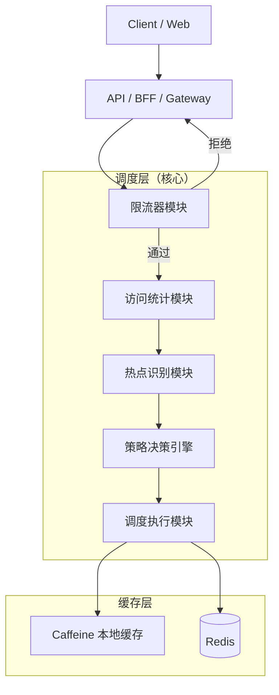
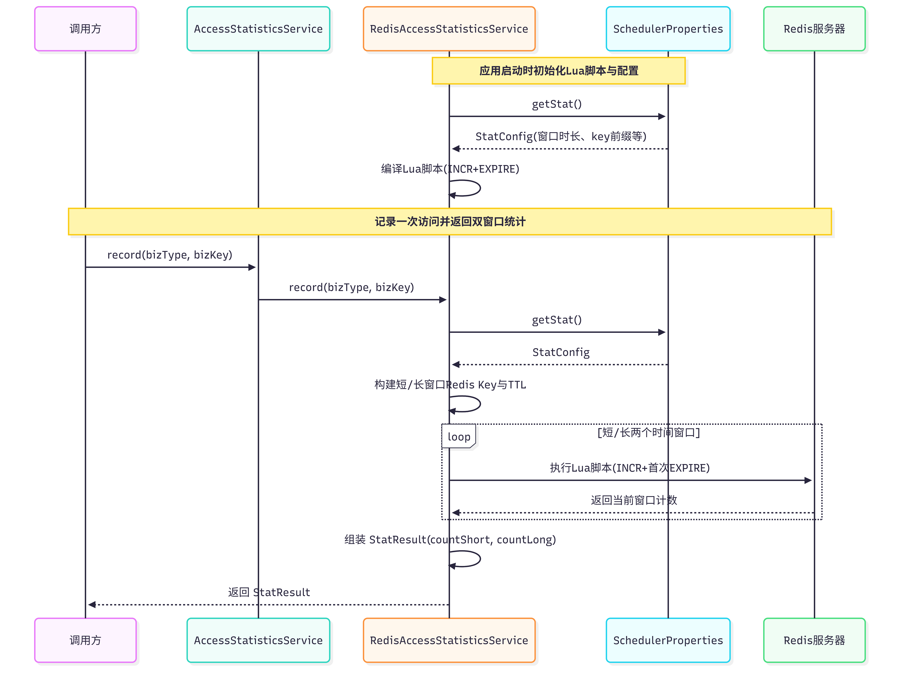
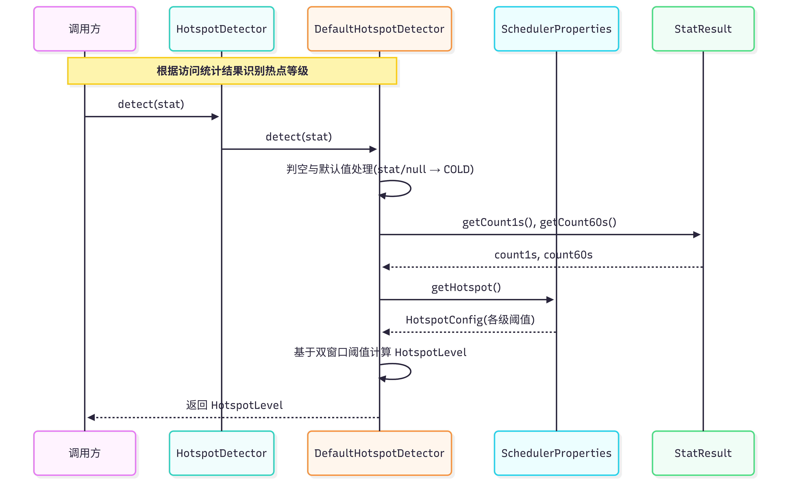
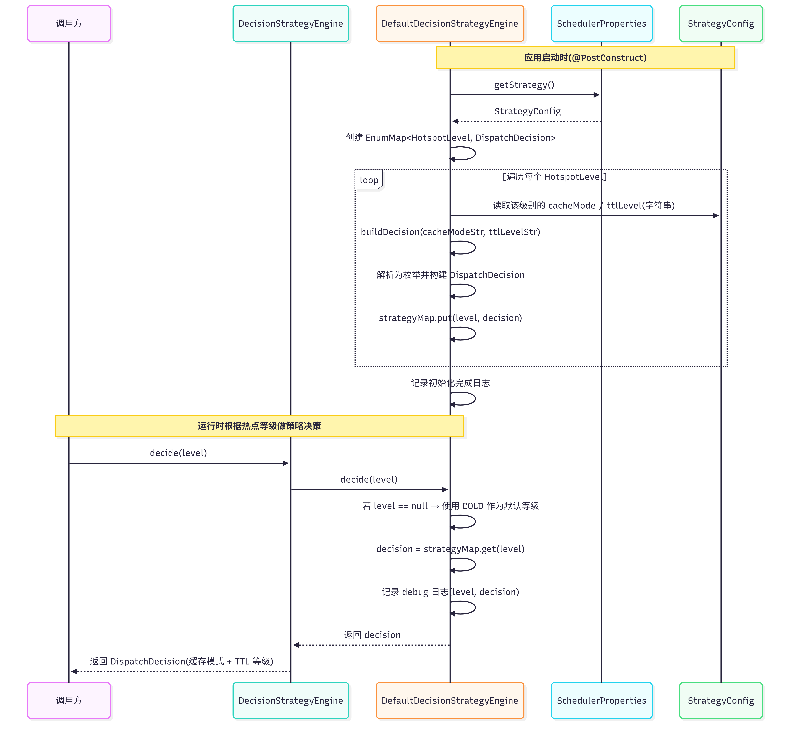

# Ali-Intern

### 1. 商品信息（商品本身信息量很大（字段多），同时有很非常多的商品（数据多）），垂直分表、水平分表的选型

先垂直，后水平。建表的时候先进行垂直分表，插入数据的时候进行水平分表。垂直分表需要依靠人工来完成，水平分表则可以使用中间件进行自动拆分。

* 垂直分表的规则中，高频、轻量的字段放在一张表中，低频、大的字段放在一张表中
* 水平分表的规则中，可设置达到一定的行数（比如10万行，100万行）然后根据id取模或者创建时间来拆分

### 2. 详细设计调度层系统：


对于上图中的调度层具体实现如下图：



1. #### **限流器模块（Rate Limiter）**

   * **功能**：作为入口第一道防线，控制整体 QPS，防止系统被打爆。

   * **实现要点**：

     - 支持全局 QPS、按 bizType、按 bizKey 三个维度的独立限流开关
     - 基于 Redis + Lua 实现原子性计数
     - 支持 fail-open / fail-closed 可配置容错机制

   * **示例**：

     ```java
     // 场景：某个商品详情页突然遭遇爬虫攻击，QPS 飙升到 10000
     RequestContext context = new RequestContext();
     context.setBizType("product");
     context.setBizKey("12345");
     
     try {
         rateLimiterService.checkLimit(context); // 检查是否超限
         // 通过限流，继续处理
     } catch (RateLimitExceededException e) {
         // 触发限流，快速失败返回 429 错误
         return "系统繁忙，请稍后重试";
     }
     ```

     在该场景中，某个商品详情页的 QPS 突然飙升至 10000。系统在接收到请求后首先进入限流模块，通过 bizType 和 bizKey 进行维度识别，并调用 `checkLimit` 方法判断是否超过预设阈值。如果流量在安全范围内，请求将继续进入后续流程；一旦超过阈值，则立即抛出限流异常并快速返回错误响应，从而避免数据库和缓存层被请求拖垮。这体现了限流模块作为“第一道防线”的保护作用。

   * **UML时序图：**

     

2. #### **访问统计模块（Access Statistics）**

   * **功能**：回答"某个 key 最近一段时间被访问了多少次"，为热点检测提供数据支撑。

   * **实现要点**：

     - 只存计数，不存业务数据
     - 双窗口设计（短窗口默认 1s、长窗口默认 60s）
     - Redis Key 格式：`stat:product:12345:1s`
     - 支持超时、重试、降级配置

   * **示例**：

     ```java
     // 场景：统计商品 12345 的访问频率
     RequestContext context = new RequestContext();
     context.setBizType("product");
     context.setBizKey("12345");
     
     StatResult stat = statisticsService.recordAndGet(context);
     // 返回结果：
     // stat.getCountShort() = 25   // 最近1秒被访问25次
     // stat.getCountLong() = 1000   // 最近60秒被访问1000次
     ```

     在该示例中，系统统计商品 12345 在不同时间窗口内的访问频率。当请求到达时，访问统计模块会对对应的 Redis Key 进行自增计数，并返回短窗口与长窗口内的累计访问次数。比如最近 1 秒内被访问 25 次，最近 60 秒内被访问 1000 次。这些统计结果并不包含任何业务数据，仅用于后续热点判断，从而实现轻量化、高性能的访问行为监控。

   * **UML时序图：**

     

3. #### 热点识别模块（Hotspot Detector）

   * **功能**：根据访问统计结果，判断某个 key 当前是 COLD / WARM / HOT 哪个级别。

   * **实现要点**：

     - EXTREMELY_HOT：`count1s >= 100` 或 `count60s >= 1000`
     - HOT：`count1s >= 20` 或 `count60s >= 300`
     - WARM：`count1s >= 5` 或 `count60s >= 60`
     - 其他为 COLD
     - 所有阈值集中配置，禁止硬编码

   * **示例**：

     ```java
     // 场景：根据统计数据判断热度
     StatResult stat = new StatResult(25, 450); // 2秒25次，120秒450次
     
     HotspotLevel level = hotspotDetector.detect(stat);
     // 返回：HotspotLevel.HOT
     // 原因：满足 count1s >= 20 且 count60s >= 300
     
     // 如果是普通商品：
     StatResult normalStat = new StatResult(2, 30); // 2秒2次，120秒30次
     HotspotLevel normalLevel = hotspotDetector.detect(normalStat);
     // 返回：HotspotLevel.COLD
     ```

     在该场景中，热点检测模块根据统计结果判断商品当前的热度等级。当短窗口访问次数达到 25 次，长窗口达到 450 次时，已经超过预设的 HOT 阈值，因此被判定为热点数据。相反，如果某商品在短窗口内仅 2 次访问，长窗口 30 次访问，则远低于阈值标准，被认定为冷数据。该模块的核心作用是将原始访问次数转化为抽象的“热度等级”，为策略决策提供明确依据。

   * **UML时序图：**

     

4. ####  策略决策引擎模块（Decision Strategy Engine）

   * **功能**：根据热点等级，输出该请求的缓存策略决策（缓存模式 + TTL 等级）。

   * **输出对象**：`DispatchDecision`

     - **CacheMode**：NONE / REMOTE_ONLY / LOCAL_AND_REMOTE 等
     - **CacheTtlLevel**：SHORT / MEDIUM / LONG

   * **实现要点**：

     - 输入仅为 `HotspotLevel`
     - 输出为 `DispatchDecision`
     - 在 `@PostConstruct` 阶段，从 `SchedulerProperties.strategy` 读取配置
     - 构建 `EnumMap<HotspotLevel, DispatchDecision>` 内存映射表
     - 运行时 `decide(level)` 仅做 O(1) 查表
     - 不做任何 IO、不访问缓存、不做限流或降级
     - 非法配置自动降级为安全默认值并打印 warn 日志

   * **示例**：

     ```java
     // 场景1：热点商品（HOT）
     HotspotLevel hotLevel = HotspotLevel.HOT;
     
     DispatchDecision hotDecision = decisionStrategyEngine.decide(hotLevel);
     
     // 根据配置返回：
     // hotDecision.getCacheMode() = CacheMode.LOCAL_AND_REMOTE
     // hotDecision.getCacheTtlLevel() = CacheTtlLevel.LONG
     
     // 场景2：冷数据（COLD）
     HotspotLevel coldLevel = HotspotLevel.COLD;
     
     DispatchDecision coldDecision = decisionStrategyEngine.decide(coldLevel);
     
     // 根据配置返回：
     // coldDecision.getCacheMode() = CacheMode.NONE
     // coldDecision.getCacheTtlLevel() = CacheTtlLevel.SHORT
     ```

     在上述两个场景中可以看到，策略决策引擎本质上并不参与缓存访问或业务逻辑执行，它只是根据输入的 `HotspotLevel` 在初始化阶段构建好的内存映射表中查找对应的 `DispatchDecision`。当等级为 HOT 时，返回“本地 + 远程缓存”并设置长 TTL；当等级为 COLD 时，返回 NONE，表示不使用缓存。整个过程不涉及 Redis、本地缓存或数据库操作，完全是一个纯函数式、无副作用的决策模块。这种设计保证了线程安全、高性能和高度可配置性，使策略调整只需修改配置文件即可生效，而无需改动代码逻辑。

   * **UML时序图：**

     

5. ####  缓存访问执行层模块（Cache Access Layer）

   * **功能**：统一执行缓存准入判断 + 本地缓存（Caffeine）+ 远程缓存（Redis）+ DB 回源的完整链路。

   * **模式说明**：

     - NONE → 不使用缓存，直接回源 DB
     - REMOTE_ONLY → 仅使用 Redis
     - LOCAL_AND_REMOTE → 本地 + Redis 双层缓存

   * **执行流程说明（以 LOCAL_AND_REMOTE 为例）**：

     1. 先查本地 Caffeine（根据 TTL Level 选择对应实例）
     2. 本地未命中 → 查 Redis
     3. Redis 命中 → 回填本地缓存
     4. Redis 未命中 → 回源 DB
     5. DB 返回成功 → 写入 Redis + 本地缓存
     6. 返回结果

   * 示例：

     ```java
     // 场景：策略引擎已经生成决策
     DispatchDecision decision = DispatchDecision.of(
         CacheMode.LOCAL_AND_REMOTE,
         CacheTtlLevel.LONG
     );
     
     String key = "product:12345";
     
     Product product = cacheAccessProxy.access(
         key,
         () -> productDao.queryById("12345"), // DB回源函数
         decision
     );
     
     // 内部核心分发逻辑示意
     return switch (mode) {
         case NONE -> accessDbOnly(key, dbLoader);
         case LOCAL_ONLY -> accessLocalOnly(key, dbLoader, decision);
         case REMOTE_ONLY -> accessRemoteOnly(key, dbLoader, decision);
         case LOCAL_AND_REMOTE -> accessLocalAndRemote(key, dbLoader, decision);
     };
     ```

     该模块将原本逻辑上可拆分的“缓存准入控制”和“缓存访问执行”统一整合到一个执行层中，通过 `CacheMode` 实现准入语义的表达。例如当 `CacheMode` 为 NONE 时，实际上等同于“准入拒绝”，直接回源数据库，不做任何缓存写入；当为其他模式时，则视为准入通过，并根据模式执行具体的缓存访问顺序。这种设计避免了额外的模块拆分，使缓存是否使用、如何使用、TTL 如何映射为具体秒数、何时回写缓存等逻辑集中在同一个执行层中，既符合当前代码结构，也保证了职责边界清晰、实现一致性强、扩展成本低。

   * **UML时序图：**

     

### 3. 了解http、rpc调用的区别，dubbo(通信机制)，springcloud Alibaba

**RPC vs HTTP 接口（高频对比）**

| 对比点  | RPC          | HTTP REST        |
|------|--------------|------------------|
| 调用方式 | 方法调用         | URL + 动词         |
| 语义   | 强类型、面向接口     | 资源导向             |
| 性能   | 高（TCP + 二进制） | 相对低（HTTP + JSON） |
| 学习成本 | 较高           | 低                |
| 可读性  | 较差           | 好                |
| 典型场景 | 内部微服务        | 对外开放 API         |

调度层计划使用RPC，因为对外接口使用 HTTP 保证通用性，对内高频、强语义的服务间调用使用 RPC，以降低延迟并提升系统整体吞吐，调度层作为基础设施组件更适合采用RPC 方式对接业务服务。

### 4. 多级缓存数据如何存储

Local → Redis → DB

以下是在决策策略引擎中，多级缓存的方案：

* COLD: 冷数据策略（不缓存）

* WARM: 中等热度策略（仅 Redis，短 TTL）

* HOT: 热点策略（本地 + Redis，正常 TTL）

* EXTREMELY_HOT: 极热策略（本地 + Redis，长 TTL）

Redis 解决“数据库压力问题”，本地缓存解决“网络与远程访问延迟问题”。当数据足够热时，两层缓存叠加可以同时优化延迟和系统承载能力。

### 5. 多级缓存数据一致性如何保证

多级缓存无法实现强一致性，只能保证最终一致性。做法是在更新数据库成功后删除缓存（而不是更新缓存），即“先更新 DB，再删除 Redis 和本地缓存”，使下一次读取强制回源并重新构建缓存，避免双写带来的不一致风险。在多实例场景下，本地缓存之间可能短暂不一致，通常通过较短 TTL 控制脏数据时间窗口，必要时可结合消息通知机制（如 Redis Pub/Sub）广播失效指令，但本地缓存本质上仅承担性能优化角色，不承担强一致保障责任。
