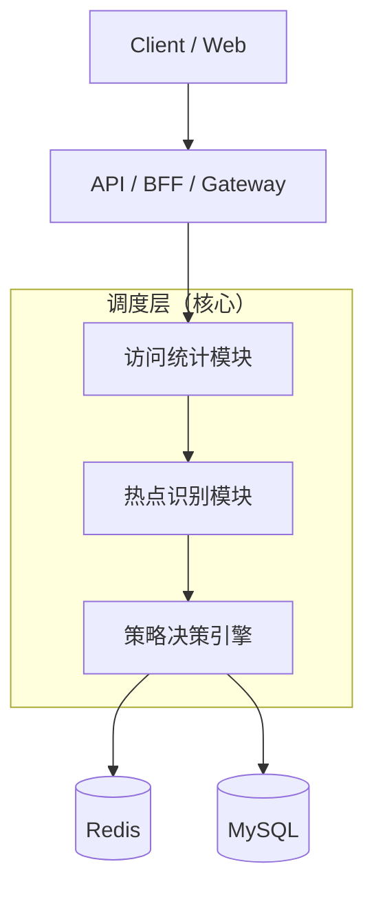

# Ali-Intern

## 2026.01.22 - 2026.02.05

### 1. 商品信息（商品本身信息量很大（字段多），同时有很非常多的商品（数据多）），垂直分表、水平分表的选型

先垂直，后水平。建表的时候先进行垂直分表，插入数据的时候进行水平分表。垂直分表需要依靠人工来完成，水平分表则可以使用中间件进行自动拆分。

* 垂直分表的规则中，高频、轻量的字段放在一张表中，低频、大的字段放在一张表中
* 水平分表的规则中，可设置达到一定的行数（比如10万行，100万行）然后根据id取模或者创建时间来拆分

### 2. 详细设计调度层系统：

对于上图中的调度层具体实现如下图：

* 访问统计模块：**在全局范围内对有缓存潜力的请求 key进行低成本、高并发的访问频次统计**，为后续热点识别和缓存决策提供客观数据依据（一段时间内某个key 被反复访问的强度与趋势）。
  
  例：当大量用户在短时间内访问商品详情时，访问统计模块会在 Redis 中持续累加该 skuId 在当前时间窗口内的访问次数。
  
  
  
* 热点识别模块：基于访问统计模块输出的频次数据，**判断某个请求 key 是否已经从“普通访问”演变为“热点访问”，并对热点程度进行分级**，供策略决策引擎判断是否将该商品详情写入 Redis、设置多长的缓存 TTL。

  例：某商品 skuId=10086 在过去 1 分钟内访问次数持续低于 10 次时，会被判定为冷数据；当访问次数稳定超过 100次/分钟时，热点识别模块会将其标记为“热数据”，触发缓存准入逻辑；如果在秒级窗口内访问量突然飙升到上千次，则会被识别为“极热数据”。

  

* 策略决策引擎：在综合请求类型、热点等级、系统当前状态等多维信息后，**统一做出这次请求该怎么走的最终执行决策，负责把统计与识别结果转化为可执行的访问策略**，而不是简单判断是否命中缓存。
  例：当热点识别模块判定某商品 skuId=10086 为“热数据”时，策略决策引擎可能决定“优先读 Redis、未命中则查 MySQL，并以 60 秒 TTL回写缓存”；当该商品升级为“极热数据”时，决策引擎则可能调整为“强制走缓存、延长 TTL 到 5分钟，必要时返回兜底数据”；而对于订单提交、支付回调这类强一致写请求，即使访问频次很高，策略决策引擎也会明确决策为“跳过缓存、直连数据库、必要时启用限流”。

  

### 3. 了解http、rpc调用的区别，dubbo(通信机制)，springcloud Alibaba

**RPC vs HTTP 接口（高频对比）**

| 对比点  | RPC          | HTTP REST        |
|------|--------------|------------------|
| 调用方式 | 方法调用         | URL + 动词         |
| 语义   | 强类型、面向接口     | 资源导向             |
| 性能   | 高（TCP + 二进制） | 相对低（HTTP + JSON） |
| 学习成本 | 较高           | 低                |
| 可读性  | 较差           | 好                |
| 典型场景 | 内部微服务        | 对外开放 API         |

调度层计划使用RPC，因为对外接口使用 HTTP 保证通用性，对内高频、强语义的服务间调用使用 RPC，以降低延迟并提升系统整体吞吐，调度层作为基础设施组件更适合采用RPC 方式对接业务服务。

### 4. 多级缓存数据如何存储

Local → Redis → DB

以下是在决策策略引擎中，多级缓存的方案：

* COLD: 冷数据策略（不缓存）

* WARM: 中等热度策略（仅 Redis，短 TTL）

* HOT: 热点策略（本地 + Redis，正常 TTL）

* EXTREMELY_HOT: 极热策略（本地 + Redis，长 TTL）

Redis 解决“数据库压力问题”，本地缓存解决“网络与远程访问延迟问题”。当数据足够热时，两层缓存叠加可以同时优化延迟和系统承载能力。

### 5. 多级缓存数据一致性如何保证

多级缓存无法实现强一致性，只能保证最终一致性。做法是在更新数据库成功后删除缓存（而不是更新缓存），即“先更新 DB，再删除 Redis 和本地缓存”，使下一次读取强制回源并重新构建缓存，避免双写带来的不一致风险。在多实例场景下，本地缓存之间可能短暂不一致，通常通过较短 TTL 控制脏数据时间窗口，必要时可结合消息通知机制（如 Redis Pub/Sub）广播失效指令，但本地缓存本质上仅承担性能优化角色，不承担强一致保障责任。
